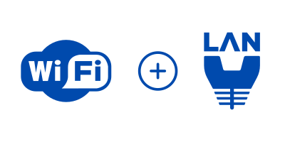

# Wireless VLAN for Public WiFi
The Wireless VLAN Configuration for Public WiFi project aims to enhance network security and optimize performance by implementing VLAN segmentation for the organization's public WiFi network. By creating separate VLANs for guest users and internal network traffic, the project seeks to improve network isolation, control access to sensitive resources, and ensure a seamless and secure experience for both guests and internal users.

## Environments and Technologies Used

- Netgear M4100-24G-POE+ Managed Switches
- FortiGate-60E Firewall
- Ubiquiti Networks UniFi AC HD

## Operating Systems Used

- Windodws 10

## High-Level Deployment and Configuration Steps

- Configure separate VLAN for guest WiFi access on swtich
- Configure interface on firewall with VLAN, IP address range, and DHCP server
- Configure security policies on the firewall interface
    - Web filtering
    - Antivirus
    - DNS filtering
- Setup wireless access point
- Monitor traffic to validate configuration

<h2>Architecture Diagram</h2>

